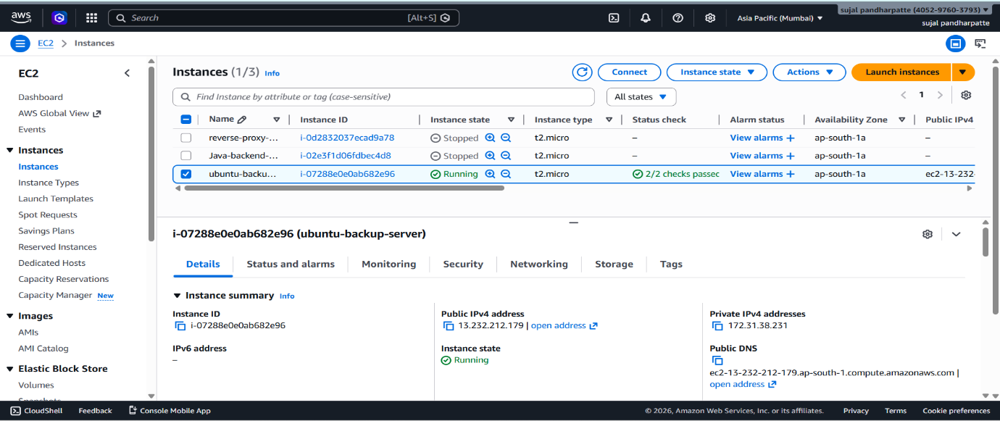
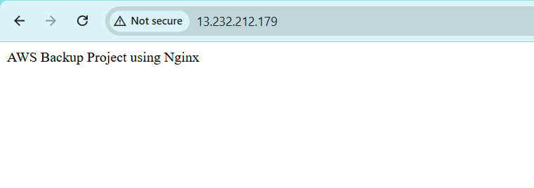
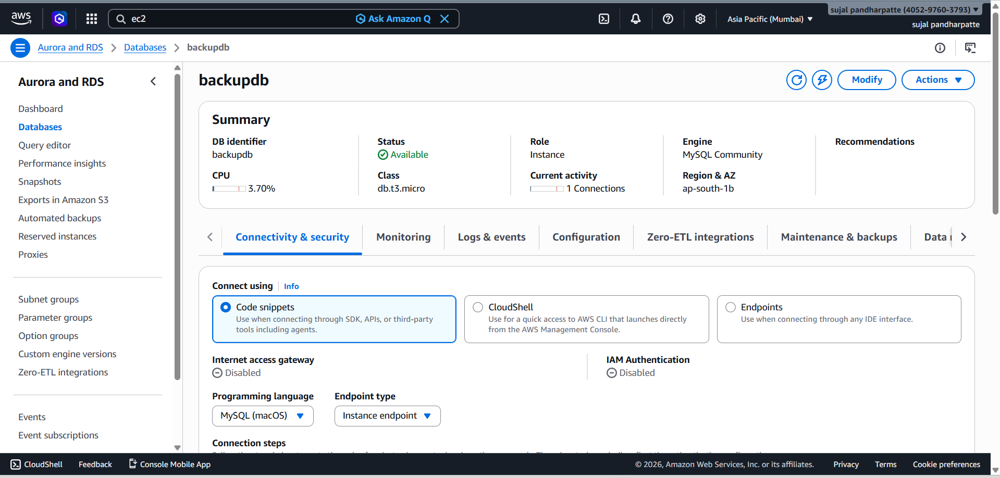
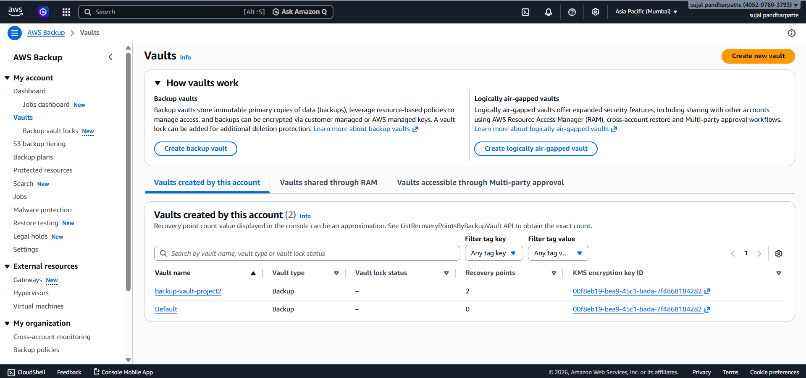
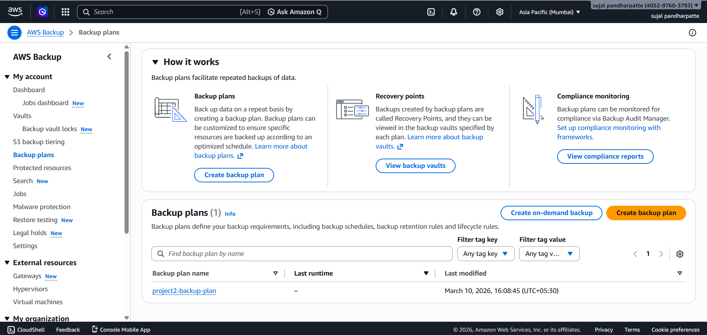
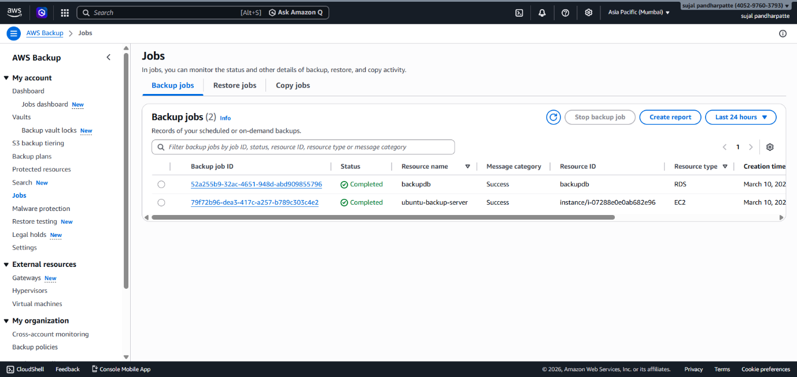

# Project 2: AWS Backup Plan for EC2 and RDS

## Project Overview

The objective of this project is to configure a **centralized backup solution** using AWS Backup to protect AWS resources — specifically EC2 instances and RDS databases. Backups help prevent data loss and ensure systems can be restored quickly in case of failures.

---

## Architecture

```
AWS Backup Service
    ├── Backup Vault (project2-backup-vault)
    └── Backup Plan (project2-backup-plan)
            ├── EC2 Instance → Recovery Points
            └── RDS Database → Recovery Points
```

---

## Steps Taken

### 1. Create EC2 Instance
- Launched an Ubuntu EC2 instance
- Installed Nginx web server to simulate a running application

### 2. Create RDS Database
- Created an Amazon RDS MySQL database
- Inserted sample data to verify backup coverage

### 3. Access AWS Backup Service
- Opened AWS Backup from the AWS Management Console

### 4. Create Backup Vault
- Created a vault named **`project2-backup-vault`** to store recovery points

### 5. Create Backup Plan
- Created a plan named **`project2-backup-plan`**
- Set daily backup frequency
- Set 7-day retention period

### 6. Assign Resources
- Assigned the EC2 instance to the backup plan
- Assigned the RDS database to the backup plan

### 7. Execute Backup
- Triggered an on-demand backup
- Verified the backup job completed successfully with recovery points created in the vault

---

## Key Configuration Details

| Setting            | Value                    |
|--------------------|--------------------------|
| Backup Vault       | `project2-backup-vault`  |
| Backup Plan        | `project2-backup-plan`   |
| Backup Frequency   | Daily                    |
| Retention Period   | 7 Days                   |
| Resources Protected | EC2 Instance + RDS Database |

---

## Issues Faced & Solutions

**Problem:** Initially, the wrong resource type was selected while creating the on-demand backup.  
**Solution:** Corrected the selection to EC2 and RDS resource types, then executed the backup successfully.

---

## Conclusion

The AWS Backup plan was successfully configured to protect both EC2 and RDS resources. Recovery points were created in the backup vault, ensuring that data can be restored when needed. This project demonstrates how AWS Backup provides a simple, centralized, and automated approach to cloud resource protection.

---

## Screenshots

### 1. EC2 Instance


---

### 2. EC2 Instance Running


---

### 3. RDS Database


---

### 4. Backup Vault Created


---

### 5. Backup Plan Created


---

### 6. Backup Job Completed


---
